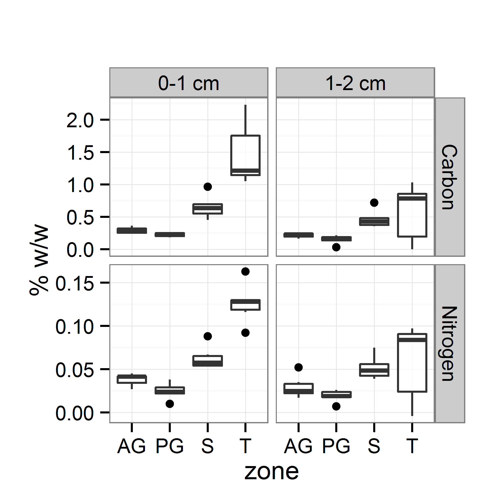
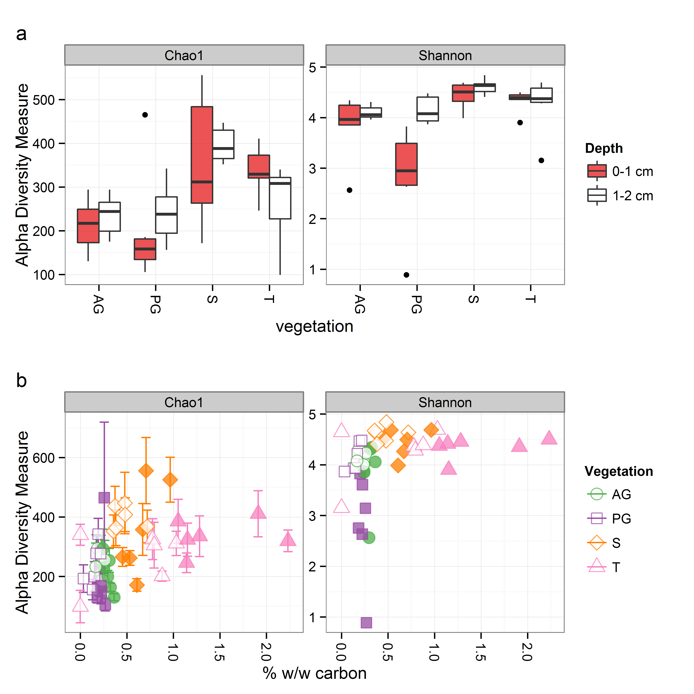
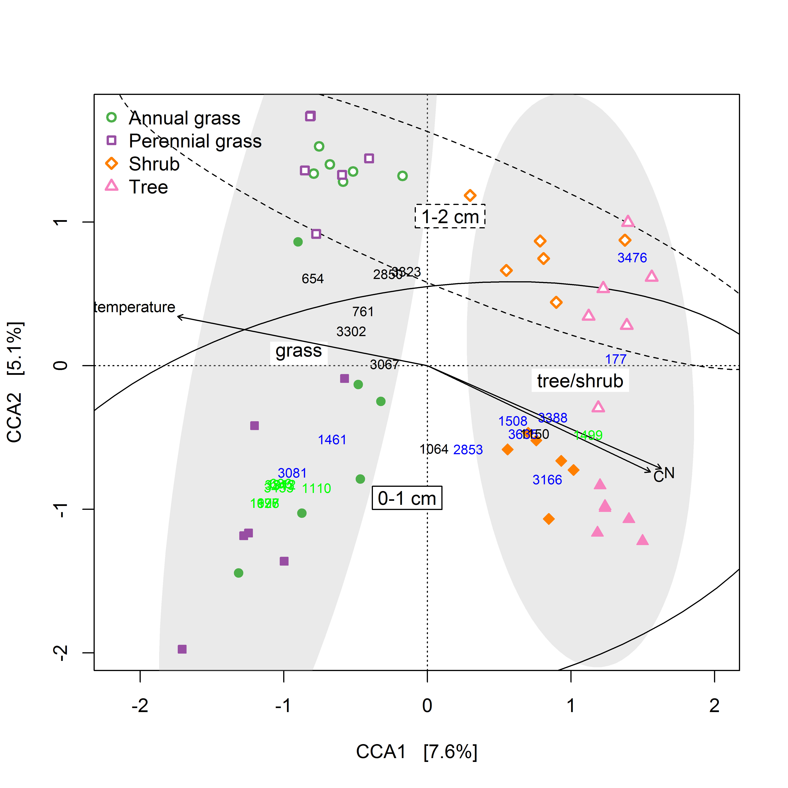
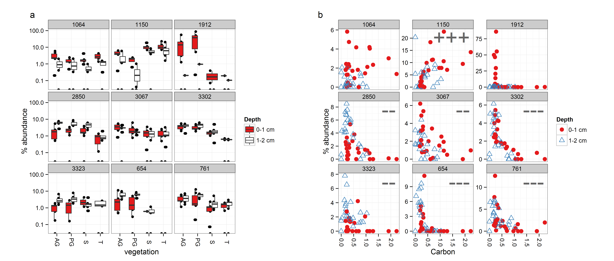
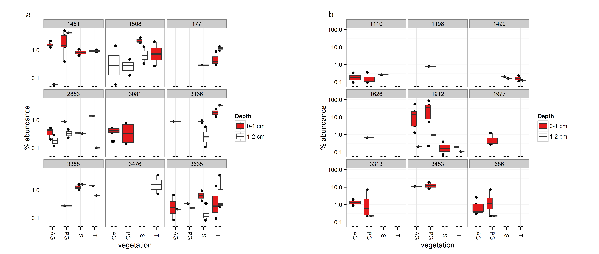
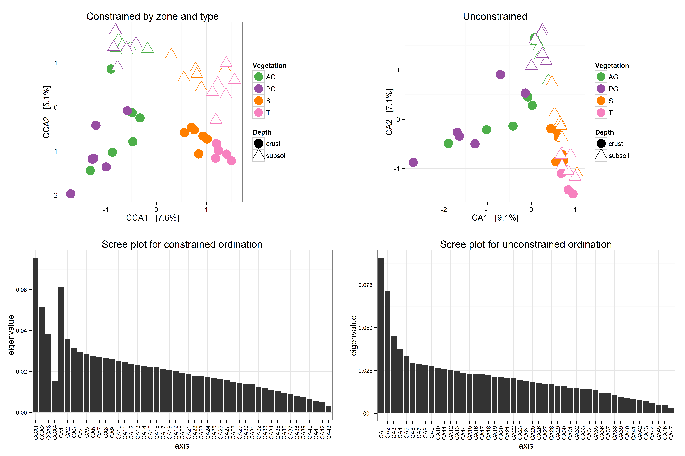
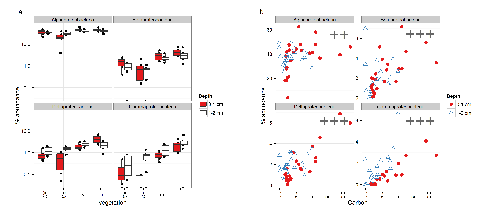

`r library("knitr")`
`r opts_chunk$set(cache=FALSE, fig.width=12)`
<link href="RMD-style.css" rel="stylesheet"></link>

Niche partitioning of bacterial communities in biological soil crusts and subsoil under grasses and trees in the semi-arid Kalahari
========================================
> David R Elliott, Andrew D Thomas, Stephen R Hoon, Robin Sen

This html file is generated from source file [kalahari_BSC_bacteria.Rmd](kalahari_BSC_bacteria.Rmd) which is the basis of all analyses presented in the above paper. The .Rmd file can be consulted to find the R commands used in the analyses. 

### Summary of Online Resources (supplementary data)
* OR1: Sample metadata and summary statistics, including pyrosequencing barcodes, number of sequences, and richness estimates. This is a tab separated text file based on the sample map used in the QIIME pipeline and other downstream analyses. This file was manually assembled for the paper following reviewer request. It is not automatically generated by this script but all data within it are products of this script.
* [OR2](#OR2): unconstrained correspondence analysis and scree plots
* [OR3](#OR3): ADONIS test results. Text file
* [OR4](#OR4): Zip file containing most of the output from the .Rmd script, but not including this html report

## Data preparation

### Load data from QIIME
```{r, message=FALSE, warning=FALSE,echo=FALSE,results='hide'}

options(width=160)
do_extras <- TRUE
# Load required packages
library("phyloseq"); library("ggplot2"); library("scales"); library("grid"); library("reshape"); library(RColorBrewer); library("xtable"); library("vegan")
packageVersion("phyloseq")
packageVersion("ggplot2")
packageVersion("scales")
packageVersion("grid")
packageVersion("knitr") 
source("my_OTU_plot8_notree.R")
calcs_for_manuscript <- list()
```

```{r setup, message=FALSE,warning=FALSE,echo=FALSE}

# relative paths
figures_dir <- "figures"
tables_dir <- "tables"
STATS_dir <- "statistics"
extra_figures_dir <- "figures_extra"
objects_dir <- "R_objects"

# set input filenames
qiime_dir <- paste(getwd(),"/data/",sep="")
otufilename <- paste(qiime_dir,"otu_table.biom",sep="")
mapfilename <- paste(qiime_dir,"Elliott_2188B_map_sff.txt",sep="")

# import_qiime(otufilename=otufilename,mapfilename=mapfilename,)
# Import the files into phyloseq objects
# Directly importing all at once failed. I worked around this by using the following sequence
# tree <- read.tree(trefilename) # tree not needed in this analysis
biom <- import_biom(otufilename,taxaPrefix="X")
map <- import_qiime_sample_data(mapfilename=mapfilename)
map$zone2line <- sub(pattern="_",replacement="\n",x=map$zone)
map.df <- read.delim(mapfilename)
expt <- merge_phyloseq(biom, map)
# Fix ranks. 
colnames(tax_table(expt)) = c("Kingdom", "Phylum", "Class", "Order", "Family", "Genus", "Species")
# fix taxa names
tax_table(expt)[,colnames(tax_table(expt))] <- gsub(tax_table(expt)[,colnames(tax_table(expt))],pattern="[a-z]__",replacement="")

# Add new names to sample data for plots
sample_data(expt)$depth2 <- "0-1 cm"
sample_data(expt)$depth2[sample_data(expt)$depth == 1] <- "1-2 cm"

samples <- as.character(sample_data(expt)$X.SampleID)
sample_data(expt)$samples <- as.factor(substr(samples, 1, nchar(samples)-1))

#relevel(as.factor(substr(samples, 1, nchar("samples")-1)))
# print(qiime_dir)
print(expt)
# Remove Mitochondria and Chloroplast. No mitochondria found.

expt <- subset_taxa(expt,Class!="Chloroplast")

this_analysis <- expt
# Add in C:N ratio and 2-line zone description
map.df$CN <- map.df$Carbon/map.df$Nitrogen
map.df$zone2line <- sub(pattern="_",replacement="\n",x=map$zone)

map.df$depth2 <- "0-1 cm"
map.df$depth2[map.df$depth == 1] <- "1-2 cm"
map.df$zc_depth <- paste(map.df$zone_code,map.df$depth, sep='')

sample_data(expt)$zc_depth <- paste(sample_data(expt)$zone_code,sample_data(expt)$depth,sep="")

```
Chloroplast and mitochondrial sequences were removed after import (very few reads).

```{r set_formatting,echo=FALSE}
# set default ggplot theme
theme_set(theme_bw(base_size = 12, base_family = ""))
alpha = 0.75
# define colour scales
#color_var = c(levels((get_variable(expt, "type"))), levels((get_variable(expt, "zone_code"))), levels((get_variable(expt, "cover"))))
color_var = c(levels((get_variable(expt, "type"))), levels((get_variable(expt, "zone_code"))))

color_pal = brewer.pal(length(color_var), "Set1")
names(color_pal) <- color_var
#length(color_pal)
color_pal["T"] <- "#F781BF" # don't like yellow
color_pal["0-1 cm"] <- color_pal["crust"]
color_pal["1-2 cm"] <- color_pal["subsoil"]

fill_pal <- color_pal
fill_pal["subsoil"] <- "white"
fill_pal["open"] <- "white"
fill_pal["1-2 cm"] <- fill_pal["subsoil"]
fill_pal["0-1 cm"] <- fill_pal["crust"]

# define shape scale
shape_var = c(levels((get_variable(expt, "type"))), "0-1 cm", "1-2 cm")
shape_scale = c(19,24,19,24)
names(shape_scale) = c(shape_var)

# copy parts of the colour scales for convenience:
zone_colours <- color_pal[c("AG",      "PG",      "S",       "T")]

# Keep lists of factors for convenience
type_names <- c("crust","subsoil")
cover_names <- c("canopy","open")
zone_code_list <- levels(factor(sample_data(expt)$zone_code))
zone_list <- levels(factor(sample_data(expt)$zone))

# zone/depth shapes and colours - added during proofing stage

zcd <- sort(unique(map.df$zc_depth))

zcd_shapes <- c(21,21,22,22,23,23,24,24)
zcd_colours <- color_pal[c("AG","AG","PG","PG","S","S","T","T")]
zcd_fill <- zcd_colours
zcd_fill[c(2,4,6,8)] <- "#FFFFFF"
zcd_solid <- c(TRUE,FALSE,TRUE,FALSE,TRUE,FALSE,TRUE,FALSE)

names(zcd_shapes) = zcd
names(zcd_colours) = zcd
names(zcd_fill) = zcd
names(zcd_solid) = zcd

```

```{r echo=FALSE}
if( !file.exists(figures_dir) ) { dir.create(figures_dir) }
if( !file.exists(tables_dir) ) { dir.create(tables_dir) }
if( !file.exists(STATS_dir) ) { dir.create(STATS_dir) }
if( !file.exists(extra_figures_dir) ) { dir.create(extra_figures_dir) }
if( !file.exists(objects_dir) ) { dir.create(objects_dir) }
```

## Pre-process data for each analysis

### Richness / diversity
The full data set was used with original count data and without rarefaction, according to recommendation of the phyloseq and vegan documentation. Rarefaction was used in an earlier version of the analysis. With rarefaction to 437 sequences (excluding 2 samples) the results and statistical tests (see later) followed almost exactly the same profile, although the absolute values changed a bit.

```{r prep_diversity,echo=FALSE,warning=FALSE,fig.width=12,fig.height=6}

expt.diversity <- expt

save(expt.diversity,file=paste(objects_dir,"/expt_diversity.rda",sep=""))
```

### OTU abundance plots and comparisons
Sequence observations were converted to percentage for each sample, to allow comparison between samples of different sequencing depth. 
```{r prep_OTUs,echo=FALSE,warning=FALSE}
expt.rel <- transform_sample_counts(expt, function(x) 100*x/(sum(x)))

# If NA in phylum position of taxonomy table then change it to "Unidentified"
tax_table(expt.rel)[tax_table(expt.rel)[,"Phylum"]==NA,"Phylum"] <- "Unidentified"

# expt.filtered <- subset_taxa(expt.rel,Phylum!="NA")
expt.filtered <- expt.rel
n_removed <- ntaxa(expt) - ntaxa(expt.filtered)
```

### Ordination
OTUs accounting for < 0.01% of sequences found in the study were excluded from ordinations.
```{r echo=FALSE,message=FALSE}
  expt.temp <- expt
  # rarefied object was tried, results very similar but loss of samples and data")

# suitable subsetting method was investigated in file "bacteria_ordination_exploration_depth.Rmd"
total_seqs <- sum(taxa_sums(expt.temp))
total_OTUs <- ntaxa(expt.temp)

rare_removed <- prune_taxa( (taxa_sums(expt.temp) / total_seqs)>0.0001, expt.temp)
  expt.ord <- rare_removed
save(expt.ord,file=paste(objects_dir,"/expt_ord.rda",sep=""))
```

## Main figures
**Figure 2.** Total carbon and nitrogen in crust and subsoil samples at each site (n=6). Boxes represent the interquartile range (IQR), and error bars extend to the most extreme values within 1.5 * IQR of the box. Median values are shown as a line within the box and outliers are shown as black spots. Sample coding: AG=annual grass, PG=perennial grass, S=shrub, T=tree. 

<a href='figures/Fig2[CN].png'></a>

```{r metadata,echo=FALSE}
map.df.melt <- melt(map.df,measure.vars=c("Carbon","Nitrogen"))
plot_title <- ""
p_chm <- ggplot(data=map.df.melt,aes(x=zone_code,y=value)) + geom_boxplot(alpha=alpha) 
p_chm = p_chm + scale_x_discrete(name="zone") + facet_grid(variable~depth2, scales="free_y")
p_chm = p_chm + theme(aspect.ratio=1) + labs(title=plot_title) 
p_chm = p_chm + scale_colour_manual(values=fill_pal) + scale_fill_manual(values=fill_pal)  + scale_y_continuous(name="% w/w") 

#p_chm 

p_chem <- ggplot(data=map.df.melt,aes(x=zone_code,y=value)) + geom_boxplot(alpha=alpha) 
p_chem = p_chem + scale_x_discrete(name="zone") + facet_grid(variable~depth2)
p_chem = p_chem + theme(aspect.ratio=1) + labs(title=plot_title) 
p_chem = p_chem + scale_colour_manual(values=fill_pal) + scale_fill_manual(values=fill_pal)  + scale_y_continuous(name="% w/w") 
#p_chem 

```

**Figure 3.** OTU richness estimation (Chao1) and diversity index (Shannon) in crust and subsoil. a. Comparison of measures at each site; b. Individual sample richness/diversity with respect to sample carbon content. Boxes represent the interquartile range (IQR), and error bars extend to the most extreme values within 1.5 * IQR of the box. Median values are shown as a line within the box and outliers are shown as black spots. Sample coding: AG=annual grass, PG=perennial grass, S=shrub, T=tree. 

<a href='figures/Fig3[rich].png'></a>

```{r richness,echo=FALSE}
# Richness - must be done before subsetting the data
alpha_measures <- c("Chao1","Shannon")

# plot of richness vs zone boxplot
plot_title <- "a"
p_rich_zone2 <- plot_richness(expt.diversity, x = "zone_code", title=plot_title,measures = alpha_measures) + theme(plot.title = element_text(hjust=-0.1),legend.key = element_blank())
p_rich_zone2 = p_rich_zone2 + geom_boxplot(alpha=alpha,aes(fill=depth2))
# Remove the original non-transparent, small-size `geom_point` layer and error bars
p_rich_zone2$layers = p_rich_zone2$layers[c(-1,-2)]
# Set the manual color and shape scales
p_rich_zone2 = p_rich_zone2 + scale_fill_manual(values=fill_pal, name="Depth")
# set titles
p_rich_zone2 = p_rich_zone2 + xlab("vegetation")

# plot of richness vs carbon
plot_title <- "b"

zone_shapes <- zcd_shapes[c(1,3,5,7)]
names(zone_shapes) <- names(zone_colours) 

# make the figure
p_rich_carbon <- plot_richness(expt.diversity, x="Carbon",  title=plot_title,measures = alpha_measures,color = "zone_code",  shape="zone_code") + theme(plot.title = element_text(hjust=-0.1),legend.key = element_blank())

p_rich_carbon = p_rich_carbon + geom_point(aes(fill=zc_depth), size=4, alpha=alpha) 
p_rich_carbon$layers = p_rich_carbon$layers[-1]
p_rich_carbon <- p_rich_carbon + scale_colour_manual(values=zone_colours, name="Vegetation") + 
  scale_fill_manual(values=zcd_fill, name="Vegetation", guide="none") + 
  scale_shape_manual(values=zone_shapes, name="Vegetation") 
p_rich_carbon = p_rich_carbon + xlab("% w/w carbon")

###

# make the legend as we want it
# decided not to use this but kept here in-case of request from editorial office
#p_rich_carbon_legend <- plot_richness(expt.diversity, x="Carbon",  title=plot_title,measures = alpha_measures,color = "zone_code",  shape="zone_code") + theme(plot.title = element_text(hjust=-0.1),legend.key = element_blank())

#p_rich_carbon_legend = p_rich_carbon_legend + geom_point(aes(fill=zone_code), size=4, alpha=alpha) 
#p_rich_carbon_legend$layers = p_rich_carbon_legend$layers[-1]
#p_rich_carbon_legend <- p_rich_carbon_legend + scale_colour_manual(values=zone_colours, name="") + 
#  scale_fill_manual(values=zone_colours, name="") + 
#  scale_shape_manual(values=zone_shapes, name="") 
#p_rich_carbon_legend

```

```{r abundant_otus3,echo=FALSE,message=FALSE,fig.width=16, comment="",fig.show='hide',warning=FALSE, eval=TRUE,results='hide',cache=FALSE}

expt.phylum <- tax_glom(expt.filtered,taxrank="Phylum")
calcs_for_manuscript["total phyla"] <- ntaxa(expt.phylum)
  
TopNOTUs <- names(sort(taxa_sums(expt.phylum), TRUE)[1:9])
 expt.phylum.top9 <- prune_taxa(TopNOTUs, expt.phylum)
calcs_for_manuscript["top 9 phyla sum"] <- mean(sample_sums(expt.phylum.top9))

TopNOTUs <- names(sort(taxa_sums(expt.phylum), TRUE)[1:16])
 expt.phylum.top16 <- prune_taxa(TopNOTUs, expt.phylum)
calcs_for_manuscript["top 16 phyla sum"] <- mean(sample_sums(expt.phylum.top16))

expt.actinobacteria <- subset_taxa(expt.filtered, Phylum == "Actinobacteria")
expt.proteobacteria <- subset_taxa(expt.filtered, Phylum == "Proteobacteria")
calcs_for_manuscript["total actinobacteria"] <- mean(sample_sums(expt.actinobacteria))
calcs_for_manuscript["total proteobacteria"] <- mean(sample_sums(expt.proteobacteria))

TopNOTUs <- names(sort(taxa_sums(expt.filtered), TRUE)[1:9])
 expt.top9 <- prune_taxa(TopNOTUs, expt.filtered)
calcs_for_manuscript["top 9 OTUs sum"] <- mean(sample_sums(expt.top9))

phylum <- my_OTU_plot(expt.phylum,9,FALSE,"Phylum","Phylum")
if(do_extras) {
  phylum_suppl <- my_OTU_plot(expt.phylum,16,FALSE,"Phylum_more","Phylum")
}
phylum.plots <- phylum$plots

# Abundant OTUs
abundant_OTUs <- my_OTU_plot(expt.filtered,9,FALSE,"All")
abundant_OTUs.plots <- abundant_OTUs$plots

# Bacteroidetes
expt.bacteroidetes <- subset_taxa(expt.filtered, Phylum == "Bacteroidetes")
bacteroidetes <- my_OTU_plot(expt.bacteroidetes,9,FALSE,"Bacteroidetes",FALSE) 
bacteroidetes.plots <- bacteroidetes$plots
calcs_for_manuscript["total bacteroidetes"] <- mean(sample_sums(expt.bacteroidetes))

# Cyanobacteria
expt.cyanobacteria <- subset_taxa(expt.filtered, Phylum == "Cyanobacteria")
cyanobacteria <- my_OTU_plot(expt.cyanobacteria,9,FALSE,"Cyanobacteria",FALSE) 
cyanobacteria.plots <- cyanobacteria$plots
calcs_for_manuscript["total cyanobacteria"] <- mean(sample_sums(expt.cyanobacteria))

# Select OTUs to show on the ordination
top_OTUs <- names(sort(taxa_sums(expt), TRUE)[1:9])
top_cyanobacteria <- names(sort(taxa_sums(expt.cyanobacteria), TRUE)[1:9])
top_bacteroidetes <- names(sort(taxa_sums(expt.bacteroidetes), TRUE)[1:9])

phylum_list <- unique(tax_table(expt.filtered)[,"Phylum"])
phylum_list <- phylum_list[!is.na(phylum_list)]
total_of_top_9s <- 0
phylum_name <- as.character(phylum_list)[2]
for (phylum_name in as.character(phylum_list)) { 
      expt.phylum <- subset_taxa(expt.filtered, Phylum == phylum_name)
      save_name <- paste(phylum_name," n OTUs",sep="")
      calcs_for_manuscript[save_name] <- ntaxa(expt.phylum)

      TopNOTUs <- names(sort(taxa_sums(expt.phylum), TRUE)[1:9])
      expt.phylum.top9 <- prune_taxa(TopNOTUs, expt.phylum)
      
      save_name <- paste(phylum_name," top 9",sep="")
      calcs_for_manuscript[save_name] <- mean(sample_sums(expt.phylum.top9))
      total_of_top_9s <- total_of_top_9s + mean(sample_sums(expt.phylum.top9))
  }

calcs_for_manuscript["total for top 9 of each phylum"] <- total_of_top_9s

# Customise PHYLUM PLOT:
pp1 <- phylum.plots[["zone"]]$plot
pp2 <- phylum.plots[["carbon"]]$plot
pp1 = pp1 + theme(plot.title = element_text(hjust=-0.1)) + ggtitle("a")
pp2 = pp2 + theme(plot.title = element_text(hjust=-0.1)) + ggtitle("b")

# Save plots


```


```{r ord_setup,echo=FALSE}
  # confidence limit for ellipses (method used is SD, SE also available)
  confidence=0.95
  # Significance of variables to the ordination will be calculated. 
  # The most significant ones will be plotted as defined by this cutoff
  biplot_sig_cutoff <- 0.05
```

```{r ordination,echo=FALSE,fig.height=10,fig.width=10,fig.keep='none',results='hide'}

#plot.new()

# remove from Top OTUs list if already in another list
top_OTUs <- top_OTUs[!top_OTUs %in% c(top_cyanobacteria,top_bacteroidetes)]
# make sure the chosen OTU's have not been pruned out of the experiment being used for the ordination:
top_OTUs <- intersect(top_OTUs,row.names(tax_table(expt.ord)))
top_cyanobacteria <- intersect(top_cyanobacteria,row.names(tax_table(expt.ord)))
top_bacteroidetes <- intersect(top_bacteroidetes,row.names(tax_table(expt.ord)))

# ordinate using phyloseq
ord <- ordinate(expt.ord~zone+type, "CCA") 

con_sites <-  plot_ordination(expt.ord,ord,"sites",title="Constrained by zone and type",color="zc_depth",shape="zc_depth") + geom_point(size = 6,aes(fill="zc_depth")) + theme(aspect.ratio=1)  + scale_colour_manual(values=zcd_colours, name="scale") + scale_fill_manual(values=zcd_fill, name="scale") + scale_shape_manual(values=zcd_shapes, name="scale") 
x_label <- as.character(con_sites$labels["x"])
y_label <- as.character(con_sites$labels["y"])


# get map out of phyloseq object and make some convenience names
map.df3 <- data.frame(sample_data(expt.ord))
map.df3$C <- map.df3$Carbon
map.df3$N <- map.df3$Nitrogen
map.df3$CN <- map.df3$Carbon/map.df3$Nitrogen
map.df3$temperature <- map.df3$soil_temp_mean

# for paper, leave zone and logCFUs out of the envfit to clarify the plot. Permutation test results given in supplementary section:
ord.ef <- envfit(ord~C+N+temperature+CN,permu=1000,data = map.df3)


# We will redirect this plot directly to a png file, then display it later in the html
png(paste(figures_dir, "Fig5[ordination].png", sep="/"),units="mm", res=600 , width = 174, height = 174)
# start with a blank plot
plot(ord,type="none",xlab=x_label,ylab=y_label) 
# add ellipses first
# Note alpha goes from 0-255. It's best to leave some transparency to preserve the grid visibility

map.df3$cover2
map.df3[map.df3$cover=="canopy","cover2"] <- "tree/shrub"
map.df3[map.df3$cover=="open","cover2"] <- "grass"
map.df3$cover2 <- as.factor(map.df3$cover2)

i <- 1
for( cov in levels(map.df3$cover2)) {
  ordiellipse(ord, map.df3$cover2,show.groups=cov,draw="polygon",alpha=80,lwd=1,label=TRUE,cex=1,kind="sd",conf=confidence,col="#BBBBBB",lty=0) 
  i <- i+1
}
ordiellipse(ord, map.df3$depth2,draw="polygon",show.groups="0-1 cm",alpha=20,lwd=1,label=TRUE,cex=1,kind="sd",conf=confidence,border="black",lty=1)
ordiellipse(ord, map.df3$depth2,draw="polygon",show.groups="1-2 cm",alpha=20,lwd=1,lty=2,label=TRUE,cex=1,kind="sd",conf=confidence,border="black")

i <- 1
# plot the points for each zone and type
 terr <- unique(map.df3$zc_depth)[1] # for testing
unique(map.df3$zc_depth)

for( terr in unique(map.df3$zc_depth)) {
  points(ord, disp="si", select=(map.df3$zc_depth==terr)&(map.df3$type=="crust"),cex = 1, pch=zcd_shapes[terr], col=zcd_colours[terr], bg=zcd_fill[terr])
  points(ord, disp="si", select=(map.df3$zc_depth==terr)&(map.df3$type=="subsoil"),cex = 1, pch=zcd_shapes[terr], col=zcd_colours[terr], bg=zcd_fill[terr],lwd=2)
  #lwd=1+(map.df3$depth*2)
#    points(ord, disp="si", select=(map.df3$zone==terr)&(map.df3$type=="subsoil"),cex = 1, pch=shape_scale[2], col=zone_colours[i],lwd=3)
}

# show the most significant variables
plot(ord.ef,p.max=biplot_sig_cutoff,col="black",lwd=3,cex=0.8) # lwd=5  -- had no effect 

# add OTU labels
text(ord, cex=0.7,select=top_bacteroidetes, display = "spec",col="blue",bg="white") 
text(ord, cex=0.7,select=top_cyanobacteria, display = "spec",col="green",bg="white") 
text(ord, cex=0.7,select=top_OTUs, display = "spec",col="black",bg="white") 

# add legend

zone_list_pretty <- gsub(pattern="_",replacement=" ",x=zone_list)
legend("topleft", cex=1, inset=c(-0.0,0), legend=c(zone_list_pretty), bty = "n", pt.bg=zcd_fill[c("AG1","PG1","S1","T1")],col=zcd_colours[c("AG0","PG0","S0","T0")], pch=zcd_shapes[c("AG0","PG0","S0","T0")],pt.lwd=2)

dev.off()

# now display the image we just saved:
```

**Figure 4.** Phylum abundance by (a) site and (b) soil carbon content. Boxes represent the interquartile range (IQR), and error bars extend to the most extreme values within 1.5 * IQR of the box. Median values are shown as a line within the box and outliers are shown as black spots. Sample coding: AG=annual grass, PG=perennial grass, S=shrub, T=tree. Significance and direction of correlation between phylum abundance and soil carbon is indicated by + or - (determined by Spearman test). Significance codes for positive correlation: +++ < 0.001; ++ < 0.01; + <0.05. Similar plots for less abundant phyla are included in supplementary data.

<a href='figures/Fig4[phylum].png'></a>

***Figure 5.*** Correspondence analysis of the microbial community. Coloured markers indicate individual samples, and dispersion ellipses show the 95 % standard deviation confidence interval for crust/subsoil and canopy/open classifications. OTU identification numbers are shown in different colours for the 9 most abundant OTUs belonging to the followng groups: full dataset (black), phylum Cyanobacteria (green), and phylum Bacteroidetes (blue). Environmental variables with significance p < 0.05, are shown as biplotted vectors (based on permutation tests; n=1000).

<a href='figures/Fig5[ordination].png'></a>

**Figure 6.** Relative abundance of the top 9 OTUs detected in the study, by (a) site and (b) soil carbon content. Boxes represent the interquartile range (IQR), and error bars extend to the most extreme values within 1.5 * IQR of the box. Median values are shown as a line within the box and outliers are shown as black spots. Significance and direction of correlation between OTU abundance and soil carbon is indicated by + or - (determined by Spearman test). Significance codes for positive correlation: +++ < 0.001; ++ < 0.01; + <0.05. Sample coding: AG=annual grass, PG=perennial grass, S=shrub, T=tree.

<a href='figures/Fig6[abundant_OTUs].png'></a>

**Figure 7.** Relative abundance of the top 9 OTUs from the phyla (a) Bacteroidetes; (b) Cyanobacteria. Boxes represent the interquartile range (IQR), and error bars extend to the most extreme values within 1.5 * IQR of the box. Median values are shown as a line within the box and outliers are shown as black spots. Sample coding: AG=annual grass, PG=perennial grass, S=shrub, T=tree. Similar plots for other phyla are included in supplementary data.

<a href='figures/Fig7[BC_otus].png'></a>

**Table 1.** Significance of factors depth, vegetation, and month on phylum abundance, as determined by Kruskal Wallis test. Significant effects were further tested by post-hoc analysis which is provided as supplementary material. Significance codes: *** < 0.001; ** < 0.01; * <0.05.  

```{r results='asis',echo=FALSE}
print(type="html",xtable(with(phylum, results_table[c("Phylum", "type_sig","zone_sig","month_sig" )])))
```

**Table 2.** Taxonomic classification of the most abundant 9 OTUs found in the study. Significance of depth, vegetation and month on OTU abundance is indicated by *** p < 0.001; ** p < 0.01; * p < 0.05, as determined by Kruskal Wallis test. Significant effects were further tested by post-hoc analyses which are provided as supplementary material.

```{r results='asis',echo=FALSE}
print(type="html",xtable(with(abundant_OTUs, results_table[c("Phylum", "Class",  "Order", "Family", "Genus", "type_sig","zone_sig","month_sig" )])))

```

**Table 3.** Taxonomic classification of the most abundant 9 Bacteroidetes and Cyanobacteria OTUs found in the study. Significance of depth, vegetation and month on OTU abundance is indicated by *** p < 0.001; ** p < 0.01; * p < 0.05, as determined by Kruskal Wallis test. Significant effects were further tested by post-hoc analyses which are provided as supplementary material.

```{r results='asis',echo=FALSE}
print(type="html",xtable(with(bacteroidetes, results_table[c("Phylum", "Class",  "Order", "Family", "Genus", "type_sig","zone_sig","month_sig" )])))
print(type="html",xtable(with(cyanobacteria, results_table[c("Phylum", "Class",  "Order", "Family", "Genus", "type_sig","zone_sig","month_sig" )])))
```

## Supplementary data
This section includes supplementary plots, and statistical tests supporting statements made in the manuscript. Additional plots and tests can be found by following links in this document or exploring the results folders.

### <a name="OR3"></a>Online Resource 3. ADONIS test for community differences with respect to vegetation zone, depth, and sampling month
This analysis was performed using adonis() function of the vegan package, which is described as follows:
> Analysis of variance using distance matrices - for partitioning distance matrices among sources of variation and fitting linear models (e.g., factors, polynomial regression) to distance matrices; uses a permutation test with pseudo-F ratios.


```{r adonis_original,eval=FALSE,echo=FALSE}
my_rank = rank_names(expt.ord)[2]
for (my_rank in rank_names(expt.ord)[2:7]) {
  print(my_rank)
  if(my_rank!="Species") {
    expt.ord.rank <- tax_glom(physeq=expt.ord,taxrank=my_rank)
  } else {
    expt.ord.rank <- expt.ord
  }  
  dist = phyloseq::distance(expt.ord.rank, "bray")
  NMDS = ordinate(expt.ord.rank, "NMDS", dist)
  print(adonis(dist ~ zone + type + month , as(sample_data(expt.ord.rank), "data.frame")) )
}
```


```{r adonis,message=FALSE,echo=FALSE,warning=FALSE}
# NOTE
# sink() will not work inside knitr.
# To generate the OR3[ADONIS].txt report it is necessary to run the script without knitr
ADONIS_report_file <- paste(STATS_dir,"/OR3[ADONIS].txt",sep="")
sink(ADONIS_report_file,split=TRUE)
cat("The same test was run at each taxonomic rank.\n\n")

my_rank = rank_names(expt.ord)[2]
for (my_rank in rank_names(expt.ord)[2:7]) {
  cat("\n\n__",my_rank,"__\n")
  if(my_rank!="Species") {
    expt.ord.taxrank <- tax_glom(physeq=expt.ord,taxrank=my_rank)
  } else {
    expt.ord.taxrank <- expt.ord
  }  
  dist = phyloseq::distance(expt.ord.taxrank, "bray")
  NMDS = ordinate(expt.ord.taxrank, "NMDS", dist)
  print(adonis(dist ~ zone * type + month , as(sample_data(expt.ord.taxrank), "data.frame")) )
}

sink()
# This analysis was also tried with the UNIFRAC phylogenetic measure. 
# Similar results were obtained
# The following code can be used to generate a UNIFRAC distance matrix:
#phy_tree(expt.ord) = root(phy_tree(expt.ord), sample(taxa_names(expt.ord), 1), resolve.root = TRUE)
#dist = phyloseq::distance(expt.ord, "unifrac")
```

### <a name="OR4"></a>Part of Online Resource 4. Statistical tests and extra plots supporting OTU abundance comparisons

Phylum results:

```{r results='asis', echo=FALSE}
cat(as.character(unlist(phylum$results)))
```

Abundant OTUs results:

```{r results='asis', echo=FALSE}
cat(as.character(unlist(abundant_OTUs$results)))
```

Bacteroidetes results:

```{r results='asis', echo=FALSE}
cat(as.character(unlist(bacteroidetes$results)))
```

Cyanobacteria results:

```{r results='asis', echo=FALSE}
cat(as.character(unlist(cyanobacteria$results)))
```

### Soil chemistry supporting information

#### Carbon
```{r chem_suppl_C,fig.height=8,fig.width=10,echo=FALSE, eval=TRUE}
# Summary of the C results
ddply(map.df,~zone+type,summarise,mean=mean(Carbon),sd=sd(Carbon))
ddply(map.df,~type,summarise,mean=mean(Carbon),sd=sd(Carbon))

# ANOVA suggests C varies significantly by type (crust vs subsoil) and zone but not month

aov_C <- aov(map.df$Carbon ~ factor(map.df$zone) + factor(map.df$type) + factor(map.df$month))
print (anova_C <- anova( aov_C ) )

print (tukey_C <- TukeyHSD(x=aov_C,ordered=TRUE) )

```

#### C:N ratio

```{r chem_suppl,fig.height=8,fig.width=10,echo=FALSE, eval=TRUE}
map.df.melt <- melt(map.df,measure.vars=c("CN"))
plot_title <- ""

CN_ratio <- ggplot(data=map.df.melt,aes(x=zone_code,y=value)) + geom_boxplot(alpha=alpha) + facet_grid(variable~type, scales="free_y")  + theme(aspect.ratio=1)+ labs(title=plot_title) + scale_colour_manual(values=fill_pal) + scale_fill_manual(values=fill_pal)  + scale_y_continuous(name="C:N ratio") + scale_x_discrete(name="vegetation")


# Summary of the C:N ratio results
ddply(map.df,~zone+type,summarise,mean=mean(CN),sd=sd(CN)) 
ddply(map.df,~type,summarise,mean=mean(CN),sd=sd(CN)) 

# ANOVA suggests CN ratio varies significantly by type (crust vs subsoil) but not by zone even if crust and subsoil data are taken separately (not shown)

aov_CN <- aov(map.df$CN ~ factor(map.df$zone) + factor(map.df$type) + factor(map.df$month))
(anova_CN <- anova( aov_CN ) )

(tukey_CN <- TukeyHSD(x=aov_CN,ordered=TRUE) )


```

#### Correlation of C and N
```{r chem_suppl2,fig.height=8,fig.width=10,echo=FALSE, eval=TRUE}
CN.lm <- lm(map.df$Nitrogen ~ map.df$Carbon) 
summary(CN.lm) 
png(paste(extra_figures_dir, "CN_cor.png", sep="/"),units="mm", res=600 ,width = 174, height = 174)
plot(map.df$Carbon,map.df$Nitrogen)
abline(CN.lm)
dev.off()
```


### Richness and diversity supporting information
Check significance of correlation between richness/diversity and carbon (Spearman):
```{r richness_suppl,fig.width=12,fig.height=6, echo=FALSE}
# earlier version of analysis used lm() / pearson, however residuals are not normal.
rich_data <- p_rich_carbon$data
#plot_title <- "Fig. _Sx\n"
#par(mfrow = c(1,2))
measure <- alpha_measures[1] # for testing

# exact=FALSE is specified in cor.test below to deal with the problem of "ties"
for(measure in alpha_measures) {
  #cat("lm fit for ",measure)
  carbon_richness <- rich_data[rich_data$variable==measure,]
    cat(measure)
  (carbon_richness.spearman <- cor.test(carbon_richness$value, carbon_richness$Carbon,method="spearman",exact=FALSE) )
  print(carbon_richness.spearman)
}

#par(mfrow = c(1, 1))

#plot_richness(expt.diversity, x="soil_temp_mean", title=NULL,measures = c("Chao1", "Shannon")) + geom_point(aes(color=cover,shape=type), size=3) + stat_smooth(method="lm", se=FALSE) + scale_colour_manual(values=fill_pal) + scale_fill_manual(values=fill_pal)
```

Check effect of depth and vegetation zone on richness/diversity (Kruskal-Wallis):
```{r richness_comparison,echo=FALSE,message=FALSE,warning=FALSE}
# richness category comparison
rich <- estimate_richness(expt.diversity, split=TRUE)

# join metadata table to richness results
rich.plus <- cbind(rich[as.character(map.df$X.SampleID),],map.df)
# remove incomplete rows, which are there because the expt.diversity object has a few samples removed due to low coverage
rich.plus <- rich.plus[complete.cases(rich.plus),]
# Check to make sure the correct rows were lined up
# identical(as.character(rich.plus$X.SampleID),row.names(rich.plus))

(kruskal.shannon_type <- kruskal.test(rich.plus$Shannon ~ rich.plus$type))
(kruskal.shannon_zone <- kruskal.test(rich.plus$Shannon ~ rich.plus$zone_code))

(kruskal.chao1_type <- kruskal.test(rich.plus$Chao1 ~ rich.plus$type))
(kruskal.chao1_zone <- kruskal.test(rich.plus$Chao1 ~ rich.plus$zone_code))

library("pgirmess")
cat("Post-hoc test - Shannon diversity")
kruskalmc(rich.plus$Shannon ~ rich.plus$zone_code)
cat("Post-hoc test - Chao1 richness")
kruskalmc(rich.plus$Chao1 ~ rich.plus$zone_code)

# Analysis of variance
# not using this now because residuals not normal
#aov.shannon_type <- aov(rich.plus$Shannon ~ rich.plus$type)
#aov.shannon_zone <- aov(rich.plus$Shannon ~ rich.plus$zone_code)
#anova_result_shannon_type <- anova(aov.shannon_type)
#anova_result_shannon_zone <- anova(aov.shannon_zone)

# Check that the residuals are normally distributed
#shapiro.test(aov.shannon_type$residuals)
#shapiro.test(aov.shannon_zone$residuals)
#qqnorm(rich.plus$Shannon)
#plot(density(rich.plus$Shannon))
#ggplot(rich.plus, aes(x=Shannon)) + geom_density() + facet_grid(cover~type)

# post-hoc analysis
#(aov.shannon_type.posthoc <- TukeyHSD.aov(aov.shannon_type))
#(aov.shannon_zone.posthoc <- TukeyHSD.aov(aov.shannon_zone))
#plot(aov.shannon_type.posthoc)
#plot(aov.shannon_zone.posthoc)


```

```{r save_data, eval=TRUE,echo=FALSE}

write.table(estimate_richness(expt.diversity, split=TRUE), 
paste(tables_dir,"richness_split.txt",sep="/"),sep="\t")

write.table(estimate_richness(expt.diversity, split=FALSE), 
paste(tables_dir,"richness.txt",sep="/"),sep="\t")

```


### <a name="OR2"></a>Online Resource 2. Ordination supplementary information
Constrained and Unconstrained comparison, and scree plots. The constrained ordination shown here is exactly the same as the one used for the main figure above.

```{r phyloseq_ordination_basic, echo=FALSE,fig.width=12,fig.height=8,results='hide'}

# ordinate using phyloseq
ord.unconstrained <- ordinate(expt.ord, "CCA") 

names(ord.unconstrained )

ord.unconstrained$inertia[[1]]

#cat("SEND THESE 2 to png only")
con_taxa <-  plot_ordination(expt.ord,ord,"taxa",title="Constrained by zone and type (taxa)",color = "Phylum") + geom_point(size = 3,alpha = 0.6) + scale_colour_hue() + theme(aspect.ratio=1)
unc_taxa <-  plot_ordination(expt.ord,ord.unconstrained,"taxa",title="Unconstrained (taxa)",color = "Phylum") + geom_point(size = 3,alpha = 0.6) + scale_colour_hue() + theme(aspect.ratio=1) 

# SITES - check for reviewer 2
samples <- as.character(sample_data(expt)$X.SampleID)
sample_data(expt.ord)$samples <- as.factor(substr(samples, 1, nchar(samples)-2))
############
months_constrained <- plot_ordination(expt.ord,ord,"sites",title="Constrained by zone and type\nSame sites are joined by a line",color="samples", shape="zone")  + geom_polygon(aes(fill = samples)) + theme(aspect.ratio=1) + geom_point(size = 6) + facet_wrap(~type) 

months_unconstrained <- plot_ordination(expt.ord,ord.unconstrained,"sites",title="Unconstrained\nSame sites are joined by a line",color="samples", shape="zone")  + geom_polygon(aes(fill = samples)) + theme(aspect.ratio=1) + geom_point(size = 6) + facet_wrap(~type) 
################


con_sites <-  plot_ordination(expt.ord,ord,"sites",title="Constrained by zone and type",color="zone_code",shape="type")  + theme(aspect.ratio=1)  + scale_shape_manual(values=shape_scale, name="Depth") + scale_colour_manual(values=fill_pal, name="Vegetation") + geom_point(size = 6,fill="white")

unc_sites <-  plot_ordination(expt.ord,ord.unconstrained,"sites",title="Unconstrained",color="zone_code",shape="type") + geom_point(size = 6) + theme(aspect.ratio=1) + scale_shape_manual(values=shape_scale, name="Depth") + scale_colour_manual(values=fill_pal, name="Vegetation") + geom_point(size = 6,fill="white")

  scree1 <- plot_scree(ord, "Scree plot for constrained ordination") + theme(axis.text=element_text(size=8))
  scree2 <- plot_scree(ord.unconstrained, "Scree plot for unconstrained ordination") + theme(axis.text=element_text(size=8))

png(paste(extra_figures_dir, "ord_taxa.png", sep="/"), width = 800, height = 800)
grid.newpage()
pushViewport(viewport(layout = grid.layout(2,1)))
print(con_taxa, vp=viewport(layout.pos.row = 1, layout.pos.col = 1))
print(unc_taxa, vp=viewport(layout.pos.row = 2, layout.pos.col = 1))
# Close the device.
dev.off()

png(paste(extra_figures_dir, "ord_months.png", sep="/"), width = 800, height = 800)
grid.newpage()
pushViewport(viewport(layout = grid.layout(2,1)))
print(months_constrained, vp=viewport(layout.pos.row = 1, layout.pos.col = 1))
print(months_unconstrained, vp=viewport(layout.pos.row = 2, layout.pos.col = 1))
# Close the device.
dev.off()


png(paste(figures_dir, "OR2[ordination].png", sep="/"),units="mm", res=600 ,width = 348, height = 232)
grid.newpage()
pushViewport(viewport(layout = grid.layout(2,2)))
print(con_sites, vp=viewport(layout.pos.row = 1, layout.pos.col = 1))
print(unc_sites, vp=viewport(layout.pos.row = 1, layout.pos.col = 2))
print(scree1, vp=viewport(layout.pos.row = 2, layout.pos.col = 1))
print(scree2, vp=viewport(layout.pos.row = 2, layout.pos.col = 2))
# Close the device.
dev.off()

# NOTE - the plots above would look better if the triangle line thickness was greater. Unfortunately this involves an annoying hack to achieve, so I haven't bothered since these are supplementary plots only. See http://stackoverflow.com/questions/19506630/control-point-border-thickness-in-ggplot


```

**Constrained and unconstrained ordinations with scree plots.**
<a href='figures/OR2[ordination].png'></a>

```{r unifrac,eval=FALSE,echo=FALSE}
# UNIFRAC is slow, 
# results reasonably similar to CCA bray. NOT RUN. Kept for reference
# UNIFRAC Principal components
phy_tree(expt.ord) = root(phy_tree(expt.ord.even), sample(taxa_names(expt.ord.even), 1), resolve.root = TRUE)
ordu = ordinate(expt.ord.even, "PCoA", "unifrac", weighted = TRUE)
plot_ordination(expt.ord,ordu,"sites",title="UNIFRAC",color="zone",shape="type") + geom_point(size = 6) + theme(aspect.ratio=1) + scale_shape_manual(values=shape_scale, name="type") + geom_point(size = 6,fill="white")

```

### OTUs supplementary

**Part of Online resource 4.** Relative abundance of Proteobacterial classes, by (a) site and (b) soil carbon content. Boxes represent the interquartile range (IQR), and error bars extend to the most extreme values within 1.5 * IQR of the box. Median values are shown as a line within the box and outliers are shown as black spots. Significance and direction of correlation between OTU abundance and soil carbon is indicated by + or - (determined by Spearman test). Significance codes for positive correlation: +++ < 0.001; ++ < 0.01; + <0.05. Sample coding: AG=annual grass, PG=perennial grass, S=shrub, T=tree.

<a href='figures/OR4[Proteobacteria].png'></a>


```{r echo=FALSE,message=FALSE,warning=FALSE,results='hide'}
expt.proteobacteria.class <- tax_glom(expt.proteobacteria, taxrank="Class")
prot.class.analysis <- my_OTU_plot(expt.proteobacteria.class,topN=4,verbose=FALSE,rename_facets="Class",plot_title="Proteobacteria_classes")
```


**Top 16 phyla**
<a href='figures_extra/phylum_more_zone.png'></a>
<a href='figures_extra/phylum_more_carbon.png'></a>

__Each Phylum in turn:__
See plots in folder [`r extra_figures_dir `](`r extra_figures_dir `) and results in [`r STATS_dir `](`r STATS_dir `)
```{r sub_bac_fun,echo=FALSE,message=FALSE,fig.width=16, comment="",fig.show='hold',warning=FALSE, eval=TRUE, results='hide'}
if(do_extras){
    phylum_list <- unique(tax_table(expt.filtered)[,"Phylum"])
  
    for (phylum_name in as.character(phylum_list)) { 
  
          phylum <- subset_taxa(expt.filtered, Phylum == phylum_name)
          # only process phyla observed in n_obs samples
          n_obs <- sum(colSums(otu_table(phylum))>0)
          if(n_obs < 16) {
              print(paste("Skipping phylum ",phylum_name," - only observed in ",n_obs," samples.",sep=""))
              next
          }
          my_OTU_plot(phylum,9,FALSE,paste("phylum_",phylum_name,sep=""))
      }
} else {
  print("Extras disabled to reduce processing time")
  }
```

### Calculations for manuscript text
```{r}
print(calcs_for_manuscript)
```

### R package versions
```{r}
print(sessionInfo(), locale = FALSE)

```


```{r save_plots,echo=FALSE, warning=FALSE,message=FALSE, eval=TRUE,results='hide'}
png(paste(figures_dir, "Fig2[CN]_alternative.png", sep="/"),units="mm", res=600 ,width = 84, height = 84)
grid.newpage()
pushViewport(viewport(layout = grid.layout(1,1)))
print(p_chem, vp=viewport(layout.pos.row = 1, layout.pos.col = 1))
# Close the device.
dev.off()

png(paste(figures_dir, "Fig2[CN].png", sep="/"),units="mm", res=600 ,width = 84, height = 84)
grid.newpage()
pushViewport(viewport(layout = grid.layout(1,1)))
print(p_chm, vp=viewport(layout.pos.row = 1, layout.pos.col = 1))
# Close the device.
dev.off()

png(paste(figures_dir, "Fig3[rich].png", sep="/"),units="mm", res=600 ,width = 174, height = 174)
grid.newpage()
pushViewport(viewport(layout = grid.layout(2,1)))
print(p_rich_zone2, vp=viewport(layout.pos.row = 1, layout.pos.col = 1))
print(p_rich_carbon, vp=viewport(layout.pos.row = 2, layout.pos.col = 1))
# Close the device.
dev.off()

png(paste(figures_dir, "Fig4[phylum].png", sep="/"), width = 348, height = 148,units="mm",res=400)
grid.newpage()
pushViewport(viewport(layout = grid.layout(1,2) ))
print(pp1 , vp=viewport(layout.pos.row = 1, layout.pos.col = 1))
print(pp2 , vp=viewport(layout.pos.row = 1, layout.pos.col = 2))
dev.off()

# Fig 5 is the ordination, exported separately

png(paste(figures_dir, "Fig6[abundant_OTUs].png", sep="/"), width = 348, height = 148,units="mm",res=400)
grid.newpage()
pushViewport(viewport(layout = grid.layout(1,2)))
print(abundant_OTUs.plots[["zone"]]$plot + theme(plot.title = element_text(hjust=-0.1)) + ggtitle("a")
      , vp=viewport(layout.pos.row = 1, layout.pos.col = 1))
print(abundant_OTUs.plots[["carbon"]]$plot + theme(plot.title = element_text(hjust=-0.1)) + ggtitle("b")
      , vp=viewport(layout.pos.row = 1, layout.pos.col = 2))
dev.off()

png(paste(figures_dir, "Fig7[BC_otus].png", sep="/"), width = 348, height = 148,units="mm",res=400)
grid.newpage()
pushViewport(viewport(layout = grid.layout(1,2)))
print(bacteroidetes.plots[["zone"]]$plot + theme(plot.title = element_text(hjust=-0.1)) + ggtitle("a")
      , vp=viewport(layout.pos.row = 1, layout.pos.col = 1))
print(cyanobacteria.plots[["zone"]]$plot + theme(plot.title = element_text(hjust=-0.1)) + ggtitle("b")
      , vp=viewport(layout.pos.row = 1, layout.pos.col = 2))
dev.off()

png(paste(figures_dir, "OR4[Proteobacteria].png", sep="/"), width = 348, height = 148,units="mm",res=400)
grid.newpage()
pushViewport(viewport(layout = grid.layout(1,2)))
print(prot.class.analysis$plots[["zone"]]$plot + theme(plot.title = element_text(hjust=-0.1)) + ggtitle("a")
      , vp=viewport(layout.pos.row = 1, layout.pos.col = 1))
print(prot.class.analysis$plots[["carbon"]]$plot + theme(plot.title = element_text(hjust=-0.1)) + ggtitle("b")
      , vp=viewport(layout.pos.row = 1, layout.pos.col = 2))
dev.off()

png(paste(extra_figures_dir, "CN_ratio.png", sep="/"),units="mm", res=600 ,width = 84, height = 174)
print(CN_ratio)
# Close the device.
dev.off()

```
